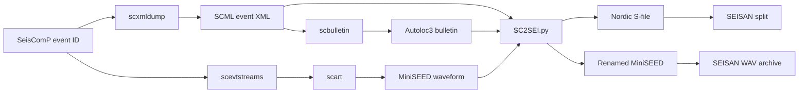

# SC2SEI

**SC2SEI** is a legacy integration prototype that transfers seismic-event information from **SeisComP** into a **SEISAN** workflow. It retrieves event metadata and waveform data, converts SeisComP event products into an 80-column Nordic S-file, and invokes SEISAN's `split` utility to register the event in a SEISAN database.

The project was developed for the operational context of the Geophysics Department of INSIVUMEH. The repository currently preserves the 2021 prototype, two sample events, their generated S-files, and a roadmap for turning the prototype into a maintainable command-line application.

> [!IMPORTANT]
> The present code is a working historical prototype, not yet a portable production package. Read [Current limitations](#current-limitations) and [Continuation guide](docs/CONTINUATION_GUIDE.md) before deploying it.

## What the project does



The pipeline has four main stages:

1. **Event extraction:** `sc-info.sh` calls SeisComP tools to export SCML metadata, an Autoloc3 bulletin, and a MiniSEED waveform window.
2. **Format conversion:** `SC2SEI.py` reads the bulletin and XML files and constructs a Nordic-format S-file.
3. **SEISAN ingestion:** `split-auto.exp` automates the interactive SEISAN `split` program.
4. **Waveform archival:** `sc2sei` moves the renamed waveform into the configured SEISAN `WAV` hierarchy.

## Repository structure

```text
SC2SEI/
├── SC2SEI.py                  # Current batch converter used by the prototype
├── seiscomp_xml_parser.py     # Extracts phase-pick information from SCML
├── seiscomp_to_nordic.py      # Earlier standalone conversion prototype
├── sc-info.sh                 # Exports event metadata and waveforms from SeisComP
├── sc2sei                     # Top-level Bash orchestration script
├── sc2sei.conf                # Environment and site-specific configuration
├── split-auto.exp             # Automates the interactive SEISAN split program
├── SC2SEI/                    # Bundled regression examples and archived outputs
├── docs/
│   └── CONTINUATION_GUIDE.md  # Ordered refactoring and development plan
└── report/
    └── SC2SEI_Report.tex      # Full technical LaTeX report
```

## Inputs and outputs

For each event, the Python converter expects three files with a common event identifier:

| Input | Purpose |
|---|---|
| `<event-id>.xml` | SeisComP XML containing picks and waveform identifiers |
| `<event-id>.txt` | Autoloc3 bulletin containing origin and magnitude information |
| `<event-id>.mseed` | Event waveform data extracted from the SeisComP archive |

The converter creates:

| Output | Purpose |
|---|---|
| `DD-HHMM-SSL.SYYYYMM` | Nordic S-file used by SEISAN |
| `YYYY-MM-DDTHH:MM:SS.MSEED` | Waveform file referenced by the S-file |

The Nordic output produced by the bundled examples uses fixed-width 80-character records. The last character identifies the record type where applicable.

## Bundled validation examples

The repository contains two June 13, 2021 events. The archived waveform files are stored inside `SC2SEI/seisan_output.tar.xz`.

| Event ID | Phase picks | Generated S-file | S-file lines | Record width |
|---|---:|---|---:|---:|
| `insivumeh2021lmaw` | 47 | `13-0258-15L.S202106` | 51 | 80 |
| `insivumeh2021lnoq` | 41 | `13-2308-12L.S202106` | 45 | 80 |

A controlled rerun of the current converter reproduced both archived S-files byte-for-byte after restoring the corresponding MiniSEED inputs under their original event IDs.

## Requirements

### Python conversion layer

- Python 3.8 or later
- `beautifulsoup4`
- An XML parser supported by Beautiful Soup, normally `lxml`

Install the Python dependencies with:

```bash
python3 -m pip install beautifulsoup4 lxml
```

### Full operational pipeline

The complete workflow additionally requires:

- A configured SeisComP installation
- Access to the SeisComP event database and SDS waveform archive
- The SeisComP commands `scxmldump`, `scbulletin`, `scevtstreams`, and `scart`
- A configured SEISAN installation
- Bash, OpenSSH, and Expect
- Permission to write to the target SEISAN database and waveform directories

## Running the historical Python converter

The current script scans a directory named `./SC2SEI/` relative to the current working directory. It does not yet honor the path argument passed by the Bash wrapper.

Each XML file in that directory must have matching `.txt` and `.mseed` files:

```text
SC2SEI/<event-id>.xml
SC2SEI/<event-id>.txt
SC2SEI/<event-id>.mseed
```

From the repository root, run:

```bash
python3 SC2SEI.py
```

Results are written to:

```text
SC2SEI/seisan_output/
```

For the bundled examples, the archived waveforms use timestamp-based names rather than the original event IDs. Restore or copy them to `<event-id>.mseed` before rerunning the converter.

## Intended operational invocation

The orchestration script is designed to accept a SeisComP event ID:

```bash
./sc2sei <event-id>
```

When no event ID is provided, it attempts to invoke the site-specific `LIST_EVENTS` command and prompts for an ID. The script then exports the event, runs the Python converter, calls SEISAN `split`, and moves the waveform into the configured SEISAN archive.

This path is currently **site-specific** and requires refactoring before it can be expected to run outside the original installation.

## Configuration

`sc2sei.conf` defines values such as:

- project installation directory;
- SEISAN database name;
- SeisComP database host and credentials;
- SDS archive location;
- SeisComP and SEISAN environment scripts.

> [!CAUTION]
> The historical configuration contains credentials directly in a tracked shell file. Do not publish or deploy real credentials this way. Remove secrets from Git history where necessary, rotate exposed credentials, and load them from protected environment variables or a restricted configuration file.

## Current limitations

The most important issues in the historical branch are:

- `SC2SEI.py` ignores its command-line path argument and always scans `./SC2SEI/`.
- The Bash wrapper expects generated files in the event working directory, while Python writes them to a nested `seisan_output/` directory.
- The converter uses fixed character offsets from an Autoloc3 text bulletin, making it sensitive to format changes.
- The XML parser derives several fields from the pick public ID instead of the explicit XML elements.
- `month_aux` is assigned only for months `01` through `09`.
- Missing magnitude, RMS, depth, files, or XML elements can cause unhandled exceptions.
- Broad exception handling can hide output-directory errors.
- Credentials and infrastructure addresses are stored in version-controlled configuration.
- Shell expansions and `ls`-based file discovery are fragile when files are missing or ambiguous.
- No automated tests, package metadata, structured logging, or continuous integration are present.
- The working branch uses Beautiful Soup, while the repository's `main` branch contains a later `xml.etree.ElementTree` parser that should be evaluated and merged deliberately.

## Recommended next step

Do **not** begin by adding new features. First create a regression test around the two archived examples, then refactor the converter behind a stable command-line interface without changing the generated S-files. The ordered plan, acceptance criteria, and suggested target architecture are in the [continuation guide](docs/CONTINUATION_GUIDE.md).

## Documentation

- [Technical report in LaTeX](report/SC2SEI_Report.tex)
- [Continuation and refactoring guide](docs/CONTINUATION_GUIDE.md)
- [SEISAN Nordic-format documentation](https://seisan.info/v13/node259.html)
- [SeisComP release documentation](https://www.seiscomp.de/doc/)
- [FDSN miniSEED documentation](https://docs.fdsn.org/projects/miniseed3/)

## Author

**BSc. Julio Medina**
